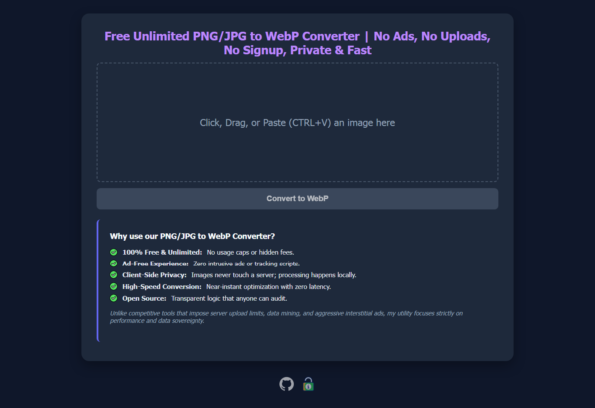

# Image Optimization Engine

A client-side, high-performance image-to-WebP conversion utility designed for zero-latency, private digital infrastructure.

  

## ⚙️ Overview
This utility allows for the aggressive compression of high-resolution imagery into the modern WebP format. By utilizing client-side processing, this tool ensures:

* **100% Data Privacy:** No images are ever uploaded to a server. Processing occurs locally within the browser memory.
* **Zero Egress/Bandwidth Costs:** By offloading processing to the client, the infrastructure requires zero backend overhead.
* **Performance Optimization:** Achieves significant payload reduction (up to 90% compression) while maintaining high visual fidelity, essential for low-latency asset delivery.

## 🛠️ Technical Specifications
* **Core Library:** `Compressor.js` (Client-side image compression).
* **Compression Algorithm:** WebP conversion @ 0.8 quality.
* **Architecture:** Static HTML/JS/CSS (Serverless-ready).
* **Efficiency:** High-concurrency capability—runs on any modern browser without external API dependencies.

## 🚀 Deployment Workflow
1. **Source:** Native image files (JPG/PNG).
2. **Transform:** Client-side WebP encoding.
3. **Delivery:** Optimized assets intended for edge-cached deployment.

## ⚖️ Operational Principles
This utility is built on the philosophy of **"Edge-First Engineering."** By minimizing payload size at the source, we ensure that every byte transported across the network is optimized for the end-user's experience.
